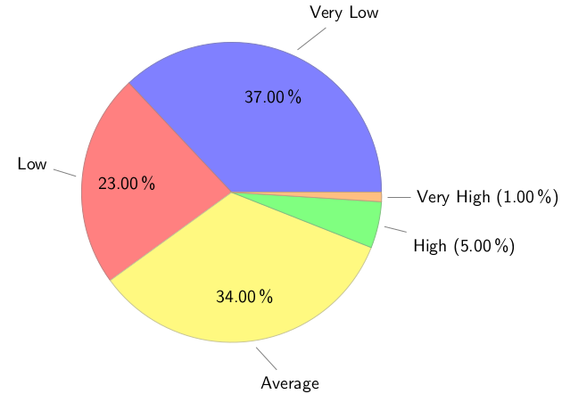
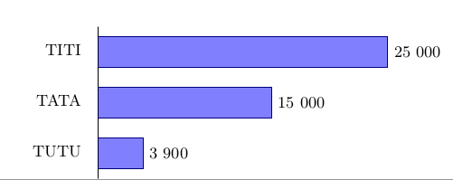
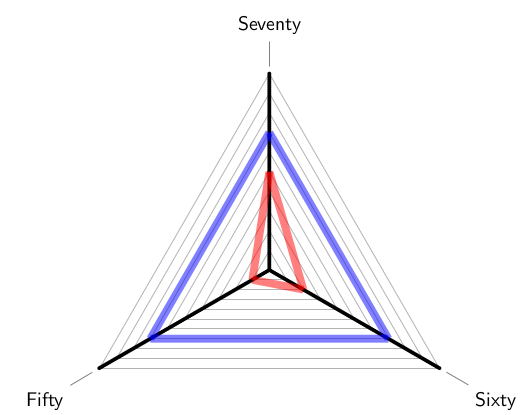

# LaTeX Fun Macros

Some macros for rendering charts with tikz & pgf in LateX

Originaly posted here : https://latex.org/forum/viewtopic.php?f=45&t=28502

## Usage

```
\usepackage{graphs}

%...

\barchart
   {5cm} %%label width
   { %% data (label/value)
     apples/432,
     banana/34,
     pineapples/1223
   }%%barchart
 
\spiderweb %% 0 to 100 grid
   {4,5cm} %% radius for labels
   {3,5cm} %% radius for spiderweb
   {70} %% baseline score
   { %% data (label/score)
     Fifty/10,
     Sixty/20,
     Seventy/50
   }%%spiderweb

 
\def\colorCycleList{{"blue","red","yellow","green", "orange", "gray" }}
\piechart{
   (Very Low,37),
   (Low,23),
   (Average,34),
   (High,5),
   (Very High,1)
}%%piechart
```

## Sample ouput

[Sample PDF](sample_output/main.pdf)







